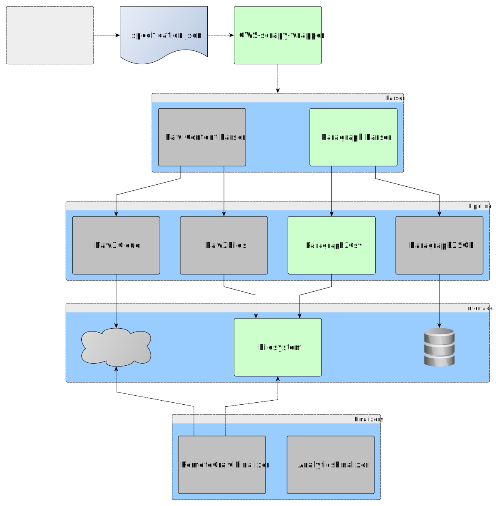

# OWS-scrapy-wrapper
Ready-to-use scrapy wrapper targeting ```.json``` specification files 
that can be created using 
[OpenWebScraper](https://github.com/MaxPensel/OpenWebScraper).

# Documentation

The OWS-scrapy-wrapper is standalone in the sense that it takes a run 
specification json file as input, to determine what urls to crawl, how 
to process responses, where to store retrieved data, etc. (see 
[specification.json](#specificationjson)).
Components such as the parsing of incoming http-responses and further 
processing of the parsed data (in pipelines or finalizers) can be 
specified in the run specification, in order to keep extensibility of 
the scrapy wrapper as high as possible.



## specification.json

```JSON
{
    "blacklist": [
         "http[s]://www\.example\.com/do-not-crawl-this.*"
    ],
    "finalizers": {},
    "logs": "C:\\Path\\To\\Your\\Log\\Dir",
    "name": "example crawlname",
    "output": "C:\\Path\\To\\Your\\Output\\Dir",
    "parser": "parsers.ParagraphParser",
    "parser_data": {
        "allowed_languages": [
            "de",
            "en"
        ],
        "keep_langdetect_errors": false,
        "xpaths": [
            "//p",
            "//td"
        ]
    },
    "pipelines": {
        "pipelines.Paragraph2CsvPipeline": 300
    },
    "urls": [
        "http://www.example.com/start-crawling-this",
        "http://www.example.com/start-crawling-that"
    ]
}
```

* _blacklist_: contains a list of regular expressions, if a uri matches one of these expressions, it will not be crawled
* _finalizers_: contains a dictionary describing the finalizers to be executed after a crawl has finished, key is path to finalizer class and value is dictionary of generic data influencing behaviour of the finalizer
* _logs_: Specify the directory you want to collect log files
* _name_: The name of the crawl.
* _output_: The file path where the crawl results will be stored
* _parser_: path to parser class, this handles all http-responses obtained during crawling
* _parser_data_: custom data to be passed to the parser instantiation
* _pipelines_: Specifies the scrapy pipelines setting, see the [scrapy documentation](https://docs.scrapy.org/en/latest/topics/item-pipeline.html)
* _urls_: contains a list of url strings, these will be the start urls, a single scrapy crawlspider is started for each given url
